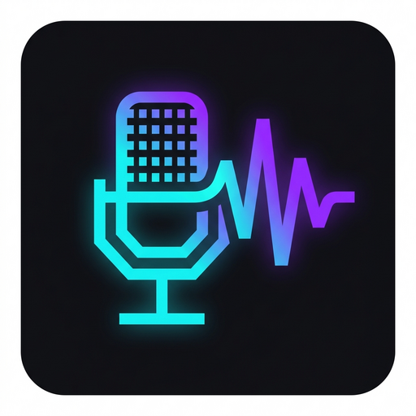

# ClearVoice Studio

<div align="center">



### Production-Grade Desktop & Web Studio for Offline Neural Text-to-Speech

[](https://nextjs.org/)
[](https://www.electronjs.org/)
[](https://www.typescriptlang.org/)
[](https://www.python.org/)
[](LICENSE)

[Features](#features) • [Architecture](#architecture) • [Getting Started](#getting-started) • [Packaging](#desktop-packaging) • [Script Formatting](#multi-speaker-scripts)

</div>

---

## Overview

**ClearVoice Studio** is a private, cross-platform studio application for neural speech synthesis. Engineered as a hybrid Next.js and Electron workstation, it operates with zero reliance on cloud APIs, external token meters, or subscription models. 

Every synthesis job is processed locally on device hardware using optimized multi-threaded neural runtimes, ensuring complete data privacy, instantaneous feedback, and broadcast-ready audio output.

---

## Features

### 🎙️ 100% Offline & Private Synthesis
- All neural inference runs entirely on your local CPU.
- Zero network telemetry, zero data egress, and no recurring API costs.
- Fully isolated runtime environment with auto-managed virtualenv and model registry.

### 👥 Intelligent Multi-Speaker Cast Engine
- Automatically parses multi-character dialogues and scripts.
- Detects speaker turns, labels, and inferred gender attributes.
- Individual voice model assignment per speaker with unified single-click dialogue rendering.
- Circular speaker badges with visual identity indexing.

### 🎛️ Acoustic Waveform & Real-Time Visualization
- Interactive canvas-based frequency spectrum visualizer and reactive audio playback.
- Dynamic waveform background responsive to voice generation and playback state.
- Live microphone stream monitor for real-time acoustic input calibration.

### ⚡ Deep Prosody & Acoustic Tuning
- Precision controls for speech rate (length scale), expressiveness (noise scale), phoneme variability (noise-w), and sentence pause cadence.
- Segment-aware prosody normalization preserving emotional inflection across dialogue turns.

### 📦 Embedded Voice Catalog & Previewer
- Built-in repository of open neural voice models across multiple languages, accents, and qualities.
- In-line audio auditioning and background voice model acquisition.

### 🖥️ Native Frameless Desktop Integration
- Frameless native window with custom OS-aware title bar controls (macOS, Windows, Linux).
- Automatic desktop status bar displaying neural engine status and active model metrics.
- Background process lifecycle management with automatic resource cleanup on exit.

---

## Architecture

```
ClearVoiceStudio/
├── src/
│   ├── app/                 # Next.js App Router (UI & API routes)
│   │   ├── api/
│   │   │   ├── catalog/     # Voice model repository registry
│   │   │   ├── download-voice/ # Voice package installation endpoint
│   │   │   ├── prosody/     # Phoneme & prosody preview endpoint
│   │   │   ├── status/      # Engine health & latency ping
│   │   │   ├── synthesize/  # Core multi-speaker synthesis pipeline
│   │   │   └── voices/      # Active model discovery
│   │   ├── globals.css      # Custom design tokens & studio stylesheet
│   │   └── page.tsx         # Main studio workstation interface
│   ├── components/          # Reusable studio components
│   │   ├── AppStatusBar.tsx # Electron desktop status footer
│   │   ├── AudioPlayer.tsx  # Waveform playback controller
│   │   ├── CastVoiceManager.tsx # Multi-speaker assignment panel
│   │   ├── CastVoiceSelect.tsx  # Voice dropdown with inline audition
│   │   └── DesktopTitleBar.tsx  # Native frameless window controls
│   └── lib/                 # Core engine drivers & analyzers
│       ├── dictation.ts     # Client-side audio transcription helpers
│       ├── piper.ts         # Python neural runtime process supervisor
│       ├── prosody.ts       # Acoustic parameter calculations
│       └── scriptAnalysis.ts# Dialogue parsing and speaker extraction
├── electron/
│   ├── main.mjs             # Frameless desktop window supervisor
│   └── preload.mjs          # Context isolation IPC security bridge
├── build-resources/         # High-resolution desktop icons & metadata
├── scripts/                 # Automated development & packaging scripts
├── piper-tts/               # Engine specifications & dependencies
└── electron-builder.yml     # Cross-platform desktop release configuration
```

---

## Getting Started

### Prerequisites

- **Node.js**: `v18.17.0` or later
- **Python**: `3.9` or later (must have `python3` and `venv` available)
- **Git**

### Installation

1. **Clone the repository:**
   ```bash
   git clone https://github.com/PMGEECODE/ClearVoiceStudio.git
   cd ClearVoiceStudio
   ```

2. **Install JavaScript dependencies:**
   ```bash
   npm install
   ```

3. **Initialize the local voice engine:**
   The application will automatically initialize the local Python runtime environment and download the default neural voice model upon initial launch.

---

## Running the Application

### Web Studio (Browser Mode)

Launch the Next.js development server:

```bash
npm run dev
```

Open [http://localhost:3000](http://localhost:3000) in your browser.

### Desktop Application (Electron Development)

Launch the native desktop window with hot reload enabled:

```bash
npm run electron:dev
```

---

## Desktop Packaging

ClearVoice Studio uses `electron-builder` to package native cross-platform binaries.

### Build for Linux (AppImage & deb)
```bash
npm run electron:build:linux
```
Output packages will be placed in the `dist-electron/` directory:
- `ClearVoice Studio-0.1.0.AppImage` (Self-contained, portable executable)
- `clearvoice-studio_0.1.0_amd64.deb` (Debian / Ubuntu installer package)

### Build for Windows (.exe)
```bash
npm run electron:build:win
```

---

## Multi-Speaker Scripts

ClearVoice Studio detects formatted dialogue scripts automatically and switches into multi-speaker mode:

```text
Narrator: The morning sun rose gently over the ridge.
Elena: Are we ready to begin the ascent?
Marcus: Equipment is checked and secured. Let's move.
Narrator: And so their expedition commenced into the unknown.
```

When multi-speaker dialogue is detected:
1. The **Multi-speaker cast panel** appears automatically.
2. Unique speakers are cataloged with turn counts and inferred traits.
3. You can assign distinct voice profiles to each character with instant inline audio previews.
4. Synthesizing renders the dialogue seamlessly into a single timeline.

---

## Privacy & Security

- **Zero Cloud Leakage**: ClearVoice Studio performs 100% of its audio synthesis on localhost.
- **Port Masking**: Local subprocess ports and communication bridges are strictly encapsulated from terminal logs and client payloads.
- **Context Isolation**: Desktop Electron integration enforces full sandbox and context isolation boundaries between renderer and main processes.

---

## License

Distributed under the MIT License. See `LICENSE` for more information.
